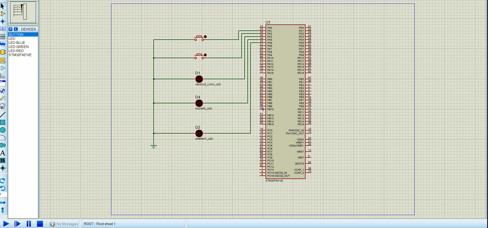

# Vehicle-door-handle-control-unit

- The project aims to implement a vehicle door handle control unit that supports an anti-theft locking capability.
The system consists of the following components:
1.  A microcontroller unit.
2.  Two push buttons, one to simulate the handle lock/unlock button and the other one to simulate the door lock/unlock.
3. Three LEDs, one to simulate the vehicle lock, one to simulate the hazard lights and one for the vehicle ambient light.
4.  All the push buttons are connected as active low.
5.  All the LEDs are connected as active high.

   

| Use Case              | Initial State        | Inputs            | Resultant System State    |action                      |
|-----------------------|----------------------|--------------------|---------------------------|---------------------------|
| default state           |System is powered off| System is powered on, no button is pressed, the switch is in the on state  | Vehicle door is locked  | The three LEDs are off|
| door unlock           | Vehicle door is locked     | Door handle button is pressed| Vehicle door is unlocked but it is closed  | Vehicle lock LED is on.Hazard LED is blinking one time 0.5 second high and 0.5 second low for each blink, Ambient light LED is on for 2 seconds then off         |
| door is open            | Vehicle door is unlocked and the door is closed.     | Door unlock button is pressed.         | Vehicle door is unlocked and the door is open.         |Ambient light LED is on         |
| anti theft vehicle lock           | Vehicle door is unlocked and the door is closed      |No buttons pressed for 10 seconds.         | Vehicle door is locked        | Vehicle lock LED is off.Hazard LED is blinking two times 0.5 second high and 0.5 second low for each blink,Ambient light LED is off.         |
|Closing the door           |Vehicle door is unlocked and the door is open.     | Door lock button is pressed         | Vehicle door is unlocked and the door is closed        | Vehicle lock LED is off. Hazard LED is off. Ambient light LED is on for one second and then is off.         |
| Locking the door           | Vehicle door is unlocked and the door is closed      | Door handle lock button is pressed         | Vehicle door is locked and the door is closed         | Vehicle lock LED is off. Hazard LED is blinking two times 0.5 second high and 0.5 second low for each blink, Ambient light LED is off.        |

  
* <h3>team members </h3>
  

|Name | Sec. | B.N. |
|-----------------|-----------------|-----------------|
| Osamah Faisl | 1 | 11 |
| Shuaib Abdulsalam | 1 | 48 |
| Bassma Alaa | 1 | 20 |
| Mariam Mounier| 2 |35 |
